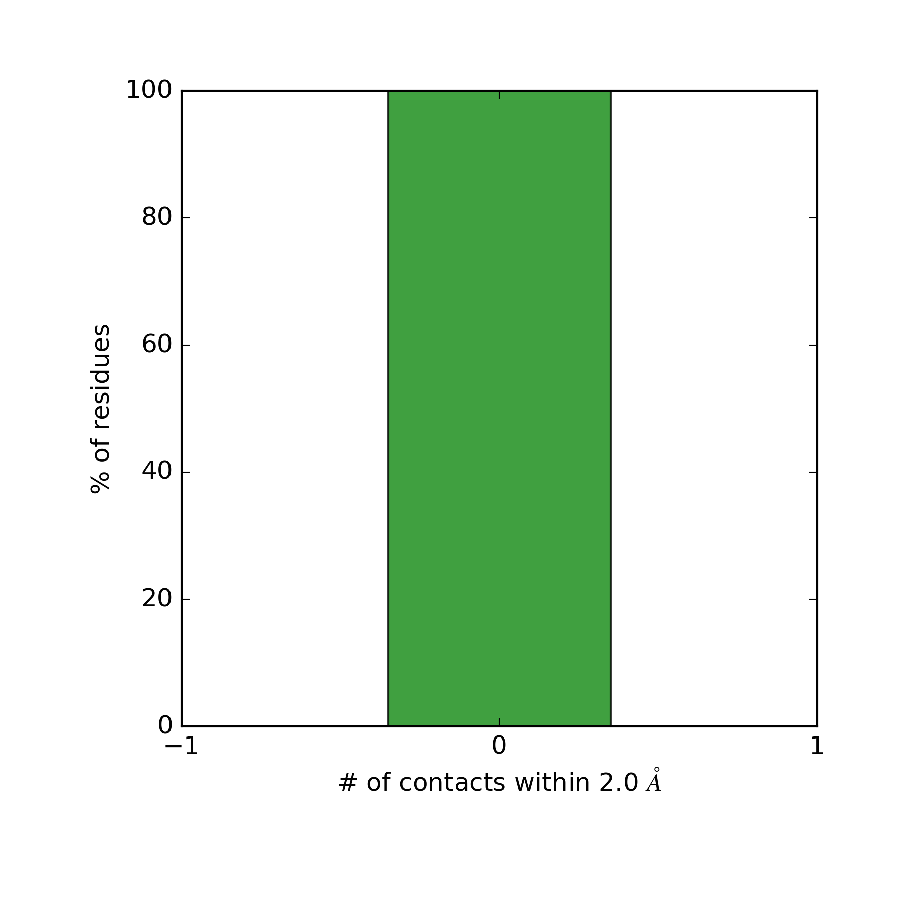
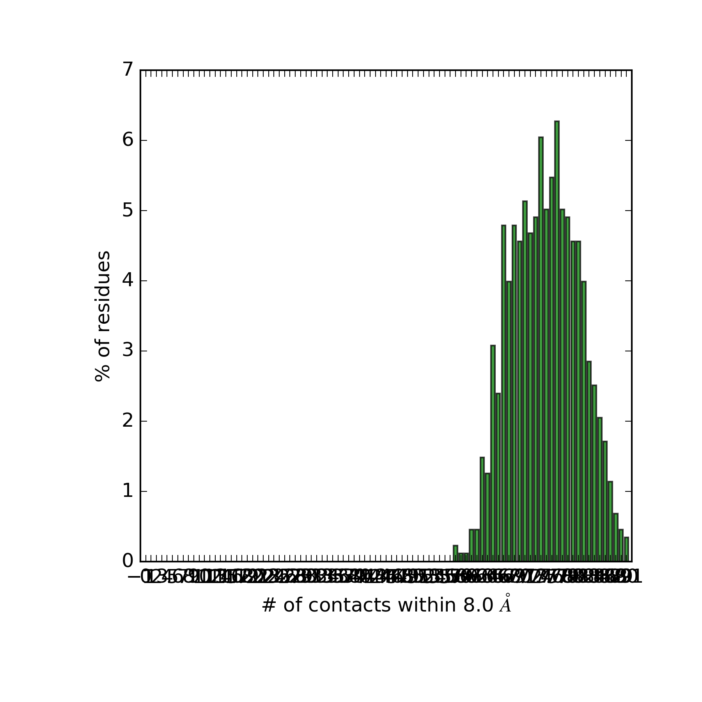

[](https://travis-ci.org/tylerjereddy/steric-conflicts)
[](https://coveralls.io/github/tylerjereddy/steric-conflicts?branch=master)
# steric-conflicts
Assessment of Steric Conflicts In Simulation System Candidates

This code is particularly useful for evaluating steric conflicts in putative simulation systems that are not quite ready for energy minimization for various reasons (i.e., just constructed using one of various molecular placement algorithms). It attempts to leverage multicore computer architectures to speed up the calculation.

This code is shipped / executed in a [docker](https://www.docker.com/) container to increase portability and reproducibility. [Installation of docker](https://docs.docker.com/engine/installation/) on various platforms is well documented.

Once docker is installed, place your candidate coordinate file in its own directory on your host machine and give the folder full write permissions (as these permissions will need to be carried into the isolated docker container). For example:
```
mkdir /username/steric_analysis_folder/
cp /username/coordinates.pdb /username/steric_analysis_folder/
chmod a+w /username/steric_analysis_folder/
```
Pull the latest version of the docker image used for this analysis to your host machine:
```
docker pull tylerreddy/steric-conflicts
```
Use the `docker run` command (details below) to analyze your coordinate file in the isolated docker container. This will involve specification of a few different arguments / settings.

Docker will need to mount the host folder containing your coordinate file (where the output files will also be written) and specify the appropriate flags to the program. The code is designed to handle one molecular 'residue' type at a time (i.e., contiguous DPPC molecules or contiguous cholesterol molecules) as it depends on being able to stride through a set of atomic indices in the coordinate file. The idea is that you can probe a single residue or all residues of a given type for their steric conflicts as long as the index topology is contiguous. 

Consider the case of probing the steric conflicts for just the first two DPPC residues in a [DPPC vesicle](http://md.chem.rug.nl/images/applications/vesicle/dppc_vesicle.gro):
```
docker run -v /username/steric_analysis_folder/:/analysis_in_container tylerreddy/steric-conflicts /bin/sh -c "python /steric_analysis/run_assessment.py -start_index 1 -end_index 24 -coord_filepath /analysis_in_container/coordinates.pdb -particles_per_residue 12 -cutoff 2.0 -pickle_filename /analysis_in_container/steric_viols.p -plot_filename /analysis_in_container/steric_histogram.png"
```
The code is executed entirely in the container and the results are placed in the container at `/analysis_in_container/`, but since that volume is actually mounted from the host, the results of the analysis will persist on your host machine after the code executes and the container closes. You will still be able to monitor progress / any problems from your host machine. Typically, you will see output indicating that `PoolWorker-N` is starting or finishing, as this code leverages multiple CPU cores if possible.

The pickled (serialized) data can be opened using the Python pickle module so that you may produce custom plots / analyses as you see fit. The data structure is simply an array of per-residue steric violation counts within the specified threshold (cutoff in Angstroms).

Consider the case of checking for steric conflicts within 2.0 Angstroms of all the DPPC residues in the above vesicle coordinate file (which is already in the docker image for testing purposes). The analysis command and resulting (default) plot are shown below:
```
docker run -v /username/steric_analysis_folder:/analysis_in_container tylerreddy/steric-conflicts /bin/sh -c "python /steric_analysis/run_assessment.py -start_index 1 -end_index 10524 -coord_filepath /steric_analysis/dppc_vesicle.gro -particles_per_residue 12 -cutoff 2.0 -pickle_filename /analysis_in_container/steric_viols_DPPC.p -plot_filename /analysis_in_container/steric_histogram_DPPC.png"
```


Unsurprisingly, a snapshot from an actual example simulation does not have any steric conflicts. For illustrative purposes, we will inflate the cutoff to 8.0 Angstroms to see a demonstration of steric conflicts:
```
docker run -v /username/steric_analysis_folder:/analysis_in_container tylerreddy/steric-conflicts /bin/sh -c "python /steric_analysis/run_assessment.py -start_index 1 -end_index 10524 -coord_filepath /steric_analysis/dppc_vesicle.gro -particles_per_residue 12 -cutoff 8.0 -pickle_filename /analysis_in_container/steric_viols_DPPC_8.p -plot_filename /analysis_in_container/steric_histogram_DPPC_8.png"
```


Clearly, increasing the cutoff has introduced steric conflicts. As this is the default plot the x-axis isn't perfectly formatted (feel free to submit a PR to improve the aesthetics / flexibility of the default plot). However, one may easily use the pickle file to produce any kind of custom plot.

Of course, identifying steric conflicts is often only the first step in a workflow. You may wish to script the process to run through all the residues in your system and accumulate all the data from different pickle files into an overall steric analysis plot, resolve the steric conflicts using an alchemical approach (i.e., http://pubs.acs.org/doi/abs/10.1021/ct501111d ) and then running the global steric analysis again to confirm that conflicts have been resolved before attempting an energy minimization / simulation. Efforts are underway to facilitate the automation of this process / steric conflict resolution loop.
